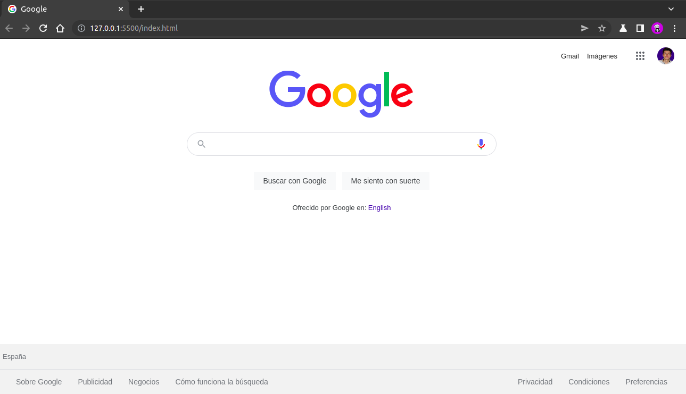
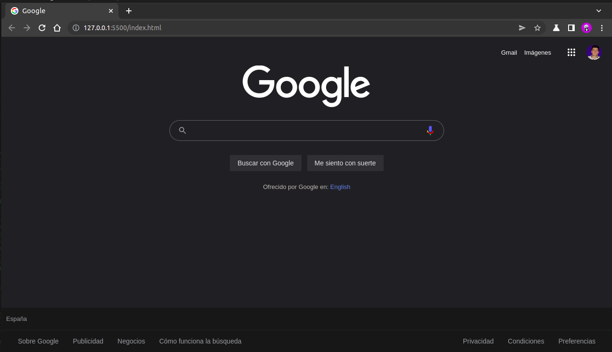
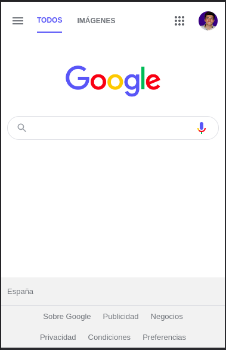
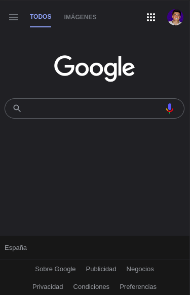

# Clon de Google
Clon de la página de inicio de Google, es una proyecto creado para prácticar los conceptos del desarrollo web. Su única intención es imitar la apariencia y el funcionamiento de www.google.com, no tiene como objetivo reemplazar o sustituir la página oficial de Google.

## Ver está página:
https://francocarballar.github.io/clon-de-google
## Tecnologías utilizadas:
- HTML
- CSS
- Responsive Design (Siguiendo la metodología de Mobile First)
- JavaScript

## Funcionamiento:
Funciona exactamente igual a la página de Google, puedes realizar una búsqueda y te rediccionará a el motor de búsqueda de Google. La apariencia del sitio es muy parecida a la del sito web original (por no decir igual). Tiene un diseño web que se adapta al dispositivo que se está empleando para visitar la página. Están todos los enlaces originales. Tiene el modo oscuro agregado, con la capacidad de guardar las preferencias en el navegador. Detecta el idioma del navegador y te redirigé a una página en inglés o una en español. Por último cambia el país dependiendo del idioma que se esté utilizando.

## Habilidades adquiridas: 
Aprendí a crear menús desplegables con JavaScript, a redireccionar a una url determinada, a detectar el idioma del navegador y a realizar acciones con ello. También aprendí a implemetar el Dark Mode o mode oscuro y a guardar el tema elegido en el navegador con ayuda de la Web Storage API.

## Imágenes:
- Desktop: 

- Desktop Dark Mode: 

- Mobile:

- Mobile Dark Mode:  

### Creado por @francocarballar